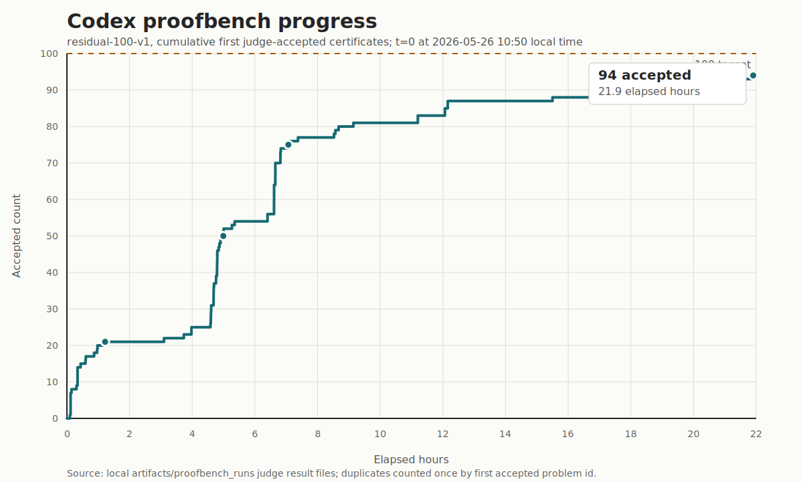
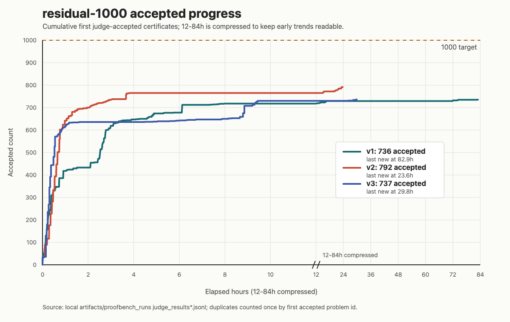

# Math Distill Stage 2 ProofBench

Unofficial residual Lean certificate benchmark for solver, LLM, and skill-workflow experiments on the SAIR Mathematics Distillation Challenge: Equational Theories Stage 2.

Chinese version: [README.zh-CN.md](README.zh-CN.md)

## Codex Progress

The following chart shows cumulative first accepted certificates over elapsed hours for `residual-100-v1`, using Codex with the `stage2-proofbench-solver` skill workflow. It counts only certificates accepted by the official-compatible Lean 4 judge/verifier, with duplicate re-verifications counted once by problem id.



The chart now uses an 80-hour x-axis to make the post-94 plateau visible. Codex reached `94 / 100` judge-accepted certificates by about `21.9` elapsed hours. After that, residual-100-v1 work continued through about `72.7` elapsed hours, but no additional official judge acceptance was found.

The remaining six rows are therefore still unsolved under the project rule that only official judge `accepted` certificates count: `residual100_v1_0007`, `residual100_v1_0012`, `residual100_v1_0022`, `residual100_v1_0040`, `residual100_v1_0041`, and `residual100_v1_0049`. Some of these rows have substantial exploratory evidence, rejected official attempts, or fake-target lemma progress, but none has an official accepted certificate yet.

The same accounting was applied to three `residual-1000` versions. The chart below compares cumulative first judge-accepted certificates over elapsed hours, with the `12-84h` range compressed so the early `0-12h` dynamics remain readable. Current local judge artifacts show `736 / 1000` accepted for v1, `792 / 1000` for v2, and `737 / 1000` for v3.



The comparison is therefore two-sided. `residual-100-v1` reached a higher solved fraction (`94%`) but then exposed six stubborn tail rows. The `residual-1000` runs currently have lower solved fractions, but much larger absolute harvests, showing that many recurring residual shapes are now covered by reusable routes. The visible plateaus after the first several hundred accepts suggest that the remaining rows are again tail-heavy rather than merely untried.

This is also a useful empirical limit for the current Codex GPT-5.5 xhigh plus `stage2-proofbench-solver` workflow. The workflow is strong on recurring residual patterns, but the best run here still plateaus at `792 / 1000`, and all three versions flatten sharply after the first `12` elapsed hours. That pattern suggests that the remaining rows require more than simply letting the same workflow run longer.

## Competition Context

This dataset is derived from the competition setting of the [SAIR Mathematics Distillation Challenge: Equational Theories Stage 2](https://competition.sair.foundation/competitions/mathematics-distillation-challenge-equational-theories-stage2/evaluation-setup). The official Stage 2 repository is [SAIRcompetition/equational-theories-lean-stage2](https://github.com/SAIRcompetition/equational-theories-lean-stage2).

The task is equational implication over magmas: given a source equation and a target equation over one binary operation `*`, decide whether the source equation implies the target equation. In Stage 2, an answer is not just a `true` or `false` string. A solver must submit a Lean 4 certificate:

- `true`: a Lean 4 proof that the source equation implies the target equation.
- `false`: a Lean 4 proof that there exists a finite magma satisfying the source equation but not the target equation.

The competition is especially interesting because the verifier is deterministic. Unlike many ordinary math datasets, this public residual set does not need to ship with ground-truth labels in order to be useful: a successful Lean 4 certificate can indirectly recover the label. If the judge accepts a `true` certificate, the row is proven true; if it accepts a `false` certificate, the row is proven false.

This repository is not an official leaderboard split. It is a small, fixed public proofbench for trying proof search, prompt design, LLM-assisted repair, and Codex skill workflows against residual problems from the Stage 2 style of task.

## Dataset

Current version:

- `data/residual-100-v1/problems.jsonl`
- `data/residual-100-v1/manifest.json`
- `data/residual-1000-v1/problems.jsonl`
- `data/residual-1000-v1/manifest.json`
- `data/residual-1000-v2/problems.jsonl`
- `data/residual-1000-v2/manifest.json`
- `data/residual-1000-v3/problems.jsonl`
- `data/residual-1000-v3/manifest.json`

`residual-100-v1` contains 100 Stage 2 equation implication problems. Each JSONL row is one problem. Important fields include:

- `equation1`: source equation.
- `equation2`: target equation.
- `eq1_id` / `eq2_id`: equation IDs from the local `eq_size5.txt`.
- `pair_index`: deterministic ordered-pair index from the local order5 pair space.
- `stratum`: order4/order5 source-target size stratum.
- `shape_bucket`: coarse source-shape to target-shape bucket used for sampling diagnostics.
- `answer` / `expected_verdict`: always `null`.

No ground-truth labels are included. The dataset also does not include model outputs, judge results, private judge backend URLs, or official `test_locked` rows.

`residual-1000-v1`, `residual-1000-v2`, and `residual-1000-v3` each contain 1000 rows with the same row schema. Their manifests report 1000 unique ordered pairs per version, with 638, 623, and 667 distinct `shape_bucket` values respectively.

## Residual Source

The local order5 ordered-pair universe starts from `3,915,693,200` possible pairs. Using deterministic strategy coverage and residual filtering, this project narrows that space to an unresolved estimate of `176,175,766`, roughly `1.8e8` residual pairs.

The public proofbench now includes both a compact 100-problem sample and a larger 1000-problem sample from that residual-style space. The intended next step is to use LLM skill workflows to attack these problems, generate Lean 4 certificates, and let accepted certificates become recovered labels.

## Sampling

`residual-100-v1` was created from the 2026-05-25 local current residual sample:

- Total order5 pair universe: `3,915,693,200`
- Current unresolved estimate: `176,175,766`
- Initial false-uncovered random pool: `2,000`
- Residual source pool after true-strategy filtering: `207`
- Final public sample: `100`
- Selection method: largest-remainder proportional quotas by `stratum`, then deterministic round-robin sampling over `shape_bucket` groups for diversity.

Final stratum distribution:

| stratum | count |
| --- | ---: |
| `order4_source_to_order5_target` | 6 |
| `order5_source_to_order4_target` | 7 |
| `order5_source_to_order5_target` | 87 |

The final sample contains 98 distinct `shape_bucket` values. No `shape_bucket` appears more than twice.

`residual-1000-v1`, `residual-1000-v2`, and `residual-1000-v3` keep the same unlabeled certificate-only protocol at larger scale. Their stratum distributions are:

| stratum | v1 | v2 | v3 |
| --- | ---: | ---: | ---: |
| `order4_source_to_order4_target` | 2 | 3 | 5 |
| `order4_source_to_order5_target` | 51 | 52 | 41 |
| `order5_source_to_order4_target` | 75 | 57 | 74 |
| `order5_source_to_order5_target` | 872 | 888 | 880 |

These larger samples are less tail-focused than the six remaining `residual-100-v1` rows but still expose a substantial long tail after the currently accepted 736 v1 rows.

## Experiment Protocol

Treat this repository as a fixed challenge set:

1. Generate a Stage 2 judge-compatible certificate for each row in `problems.jsonl`.
2. Verify the certificate with the official-compatible Lean 4 judge/verifier.
3. Count only judge-accepted certificates as solved.
4. Record the model, prompt, skill version, raw response, judge verdict, and error summary.

Remote verification uses the judge-v2 control service through asynchronous jobs: `POST /jobs` followed by `GET /jobs/{job_id}/wait`. The helper defaults to the current judge-v2 control endpoint and can be overridden with `--base-urls`, `PROOFBENCH_REMOTE_JUDGE_V2_BASE_URLS`, or `STAGE2_REMOTE_JUDGE_BASE_URLS`.

Recommended report fields:

- `attempted`: number of attempted rows.
- `accepted`: number of judge-accepted rows.
- `accepted_rate`: `accepted / sample_count`, for example `/ 100` for `residual-100-v1` or `/ 1000` for `residual-1000-v1`.
- `true_accepted` / `false_accepted`: accepted counts by certificate verdict, if available.
- `reproducibility_notes`: model, date, prompt, solver code, skill workflow, and toolchain versions.

## Notes

This benchmark is not an unbiased estimate of the full 176M residual universe. It is meant to be a small but stable proofbench for comparing models, prompts, skill workflows, and proof repair methods on exactly the same rows.

Because the rows do not contain labels, a claimed answer should be considered experimental until it is backed by an accepted Lean 4 certificate.

## Tooling

The lightweight package exposes repeatable helpers:

```bash
uv run proofbench-build-judge-input --problems data/residual-100-v1/problems.jsonl --candidates candidates.jsonl --output judge_input.jsonl
uv run proofbench-remote-judge --input judge_input.jsonl --output judge_results.jsonl --summary summary.json --base-urls "$PROOFBENCH_REMOTE_JUDGE_V2_BASE_URLS"
uv run proofbench-summarize-results judge_results.jsonl --summary summary.json
uv run proofbench-log-attempt --ledger attempts.jsonl --from-results judge_results.jsonl --route my-route
uv run proofbench-route-problem --ids 0041 --format json
uv run proofbench-audit-attempts --ids 0041 --format text
uv run --group dev pytest
```

Install optional solver dependencies with `uv sync --extra solver` when running the Z3/PySAT helper scripts under the Codex skill.

## Quick Checks

```bash
wc -l data/residual-100-v1/problems.jsonl data/residual-1000-v1/problems.jsonl
jq '.selected_summary' data/residual-100-v1/manifest.json
jq '.selected_summary' data/residual-1000-v1/manifest.json
jq '.selected_summary' data/residual-1000-v2/manifest.json
jq '.selected_summary' data/residual-1000-v3/manifest.json
```
